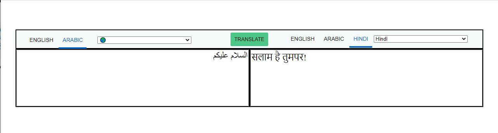

# super-translate

# Intro:

This is a Python/Flask translation app, it translates text from one language to another,
Supports 80 languages. Application based on the IBM Watson™ Language Translator API. The application has an easy-to-use user interface that is similar to Google Translate

## Problem statemen:
Create Python translate application that can be used to translates text from one language to another.

## Proposed solution:
a Flask application has been created that communicate with (IBM Watson™ Language Translator API) that can be used to translate text from one language to another

## How It Works:

a Flask application which can be used to allow the user to select the source language and target language and enter the text to be translated, then securely send the data to the server using a POST (AJAX) request, then the server sends a request to IBM Watson API in the source and target language and the text to be translated, in return the translation API will return the translated text or an error in the response to the server and then the server will send the response back to the client side, JavaScript will use the data returned and display the translated text in the UI or display an error if It was found. (Jinja2 is used to display the supported languages)

### Languages, Libraries, techniques, Packages (Operating environment):

1. Python
2. JavaScript
3. HTML5
4. CSS3
5. Flask
6. AJAX
7. ibm-watson
8. Jinja2

## Present status of development:

1. User interface (HTML/CSS)
2. AJAX request processing, data rendering, client-side communication, Validation, error handling (JavaScript)
3. Backend Server (flask)
-------------------------------------------------------------------------------

# API end Points:

### Home [GET]  (`/` or `/home` or `/translate`):
perform a post request to get the available languages and Render the home page

### Translate [POST]  (`/translator`):
Responsible for receiving AJAX post requests from the client side, filtering the data, then executing a request to the IBM-Watson API to translate the text and returning the response to the client

-------------------------------------------------------------------------------

## installation requirements:
1. Python
2. For windows users (GitBash) / Linux or Mac User can use terminal python
3. code editor (Atom, Notepad++, VSC)

## How to start the App:
1. open GitBash or terminal on Linux/Mac
2. use `cd "folder-name"`
3. `pip install - r requirements.txt`
4. `export FLASK_APP=flaskr`
5. `export FLASK_ENV=development`
6. `flask run`
7. open web browser
8. Visit localhost:5000/

## Useful resources:

1. https://cloud.ibm.com/apidocs/language-translator?code=python#listlanguages (IBM Watson™ Language Translator API [Python])
2. https://realpython.com/flask-by-example-part-1-project-setup/ (How to deploy/start flask app)
3. https://www.twilio.com/blog/how-run-flask-application (How to deploy/start flask app)
4. https://udacity.com/ (Learning Python/JavasScript/Flask)
